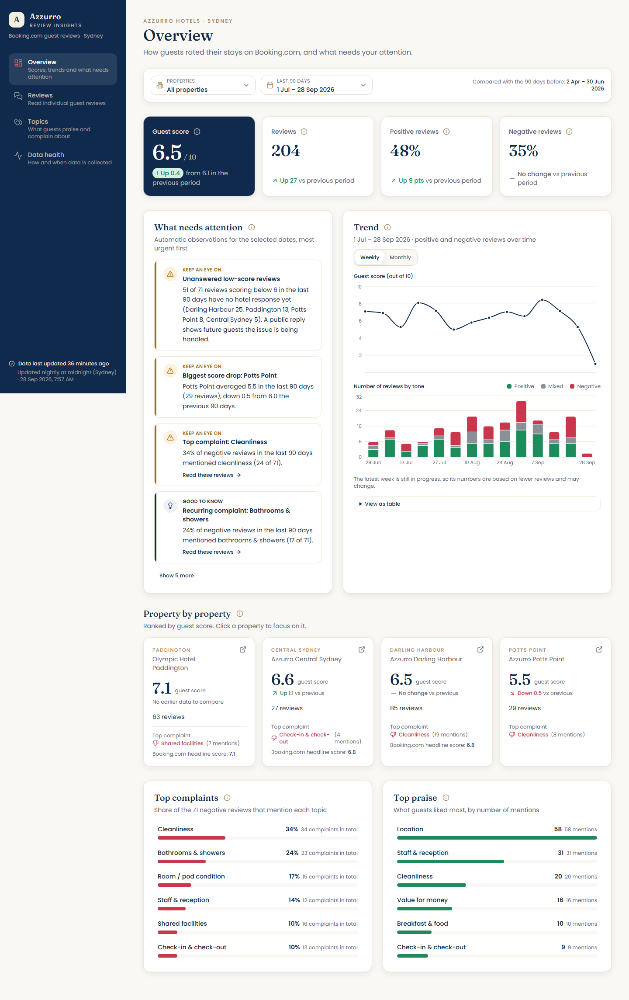
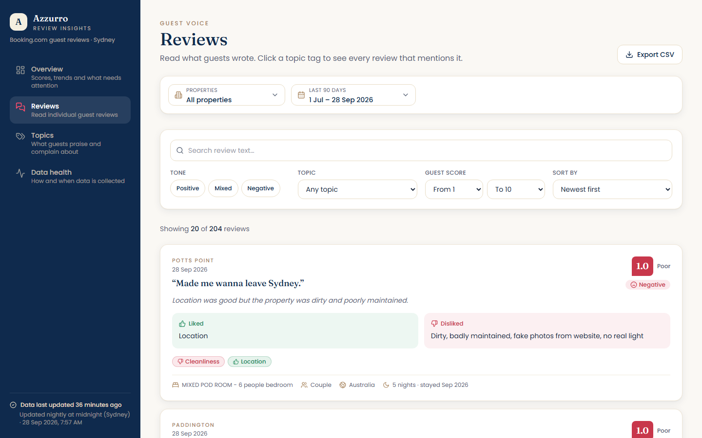
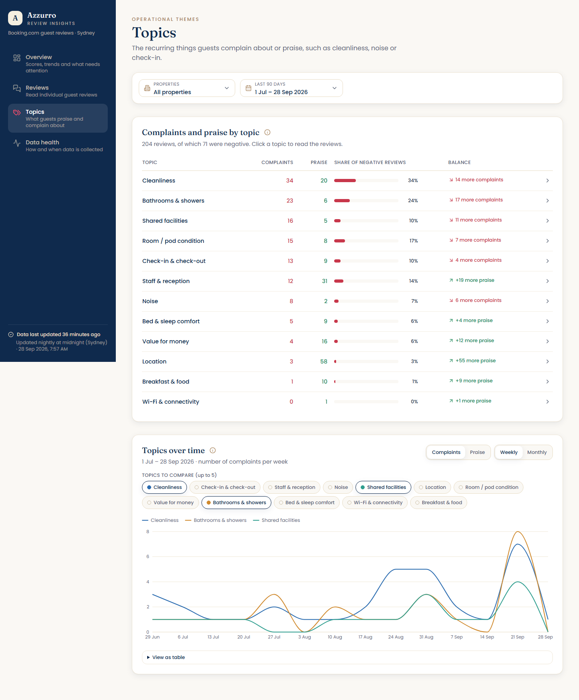
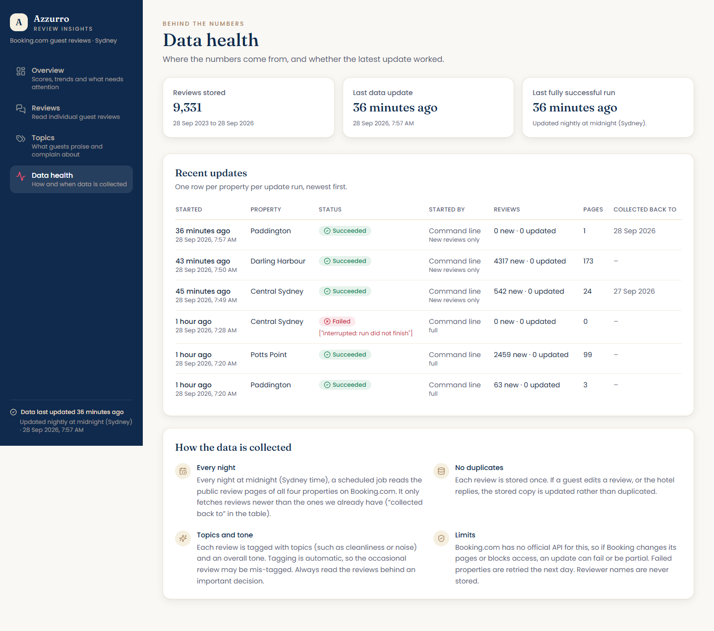
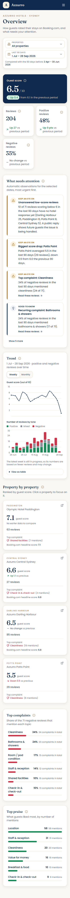
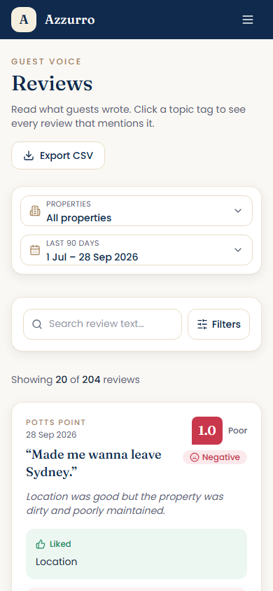

# Azzurro Hotels — Booking.com Review Insights

An operations dashboard over **9,331 real Booking.com guest reviews** for four Azzurro properties in Sydney,
built for non-technical operations staff: what guests scored this week, how that compares with last week,
which property is slipping, and **what guests are actually complaining about**.

| | |
|---|---|
| **Backend** | Python 3.10 · FastAPI · MongoDB Atlas · 215 tests, lint clean |
| **Frontend** | React 18 · Vite 5 · TypeScript · Tailwind 3 · Recharts |
| **Collection** | Booking's own GraphQL review endpoint over plain HTTP — no browser, no login, no cookies |
| **Insights** | Keyword/phrase rules (all reviews) + Groq LLM (recent reviews), 12 operational topics |
| **Schedule** | Vercel Cron, nightly at midnight Sydney |

---

## 0. Getting the project

```bash
git clone https://github.com/sumitrout1404/review_scraper_combined.git
cd review_scraper_combined
```

Or download the ZIP from GitHub (**Code → Download ZIP**) and extract it anywhere.

Everything is in one place — `backend/` holds the API, the scraper and the classifier, and `frontend/`
holds the dashboard. Nothing else needs downloading. Next:

1. **Set up the backend** and **fill in the environment values** — see [Quick start](#1-quick-start).
   Copy `backend/.env.example` to `backend/.env` and put your own MongoDB connection string in it.
   The only required value is `MONGODB_URI`; everything else has a working default.
2. **Set up the frontend**: copy `frontend/.env.example` to `frontend/.env`. The default already points
   at the local backend.
3. **Load the data**: either import the shipped sample (`backend/data/samples/reviews.json`, all 9,331
   reviews) or run the scraper yourself.
4. **Run both** and open the dashboard.

`.env` files are never committed — only the `.env.example` templates are, so your keys stay on your machine.

---

## The dashboard

**Overview** — the week at a glance: guest score against the previous period, what needs attention right
now, how each property is doing, and where the trend is going.



**Reviews** — the full feed, filterable by property, date, tone, topic, score and free text. Each review
shows what the guest liked and disliked side by side, with the topics we detected tagged underneath.



**Topics** — the recurring operational themes, ranked by how often guests complain, and how each one
moves over time. Click any topic to read the reviews behind the number.



**Data health** — every collection run, so staff can see at a glance whether the numbers are current
and what happened if they aren't.



**On a phone** — the sidebar folds into a drawer, cards stack, and tables become cards.

<p>
  
  
</p>

Written for non-technical users throughout: "Guest score", not `avg_score`; changes shown with arrows **and**
words, never colour alone; a "What does this mean?" popover on every metric; a **Low sample** badge whenever a
number rests on fewer than 5 reviews; and a freshness indicator that warns if collection has stalled.

---

## 1. Quick start

Requirements: **Python 3.10+**, **Node 18+**, and a **MongoDB** connection string (Atlas free tier is fine).

```bash
git clone <repo> && cd scraper

# ---- Backend -------------------------------------------------------------
cd backend
python -m venv .venv && .venv/Scripts/activate     # macOS/Linux: source .venv/bin/activate
pip install -r requirements-dev.txt
cp .env.example .env                               # then edit: MONGODB_URI is required
python -m uvicorn app.main:app --reload --port 8000 --env-file .env

# ---- Frontend (second terminal) -----------------------------------------
cd frontend
npm install
cp .env.example .env                               # VITE_API_BASE_URL=http://localhost:8000
npm run dev
```

Dashboard: **http://localhost:5173** · API docs: **http://localhost:8000/docs**

To reach it from a phone on the same Wi-Fi, start both with `--host 0.0.0.0`, set
`VITE_API_BASE_URL` to `http://<your-ip>:8000`, and add `http://<your-ip>:5173` to `CORS_ORIGINS`.

### Getting data

The database is **not** in the repo. Either collect it fresh, or import the shipped sample:

```bash
cd backend
python -m collector import --from data/samples/reviews.json   # ~30s, all 9,331 reviews
python -m analysis                                            # classify them (rules; LLM if GROQ_API_KEY set)
```

Or scrape from scratch — a full backfill of all four properties takes about 35 minutes with polite delays:

```bash
python -m collector run --full      # then incremental afterwards: python -m collector run
python -m collector status
```

### Environment variables

Everything is documented in [`backend/.env.example`](backend/.env.example). Only `MONGODB_URI` is required.

| Variable | Purpose |
|---|---|
| `MONGODB_URI` | **Required.** `mongodb+srv://…`. Use `mongomock://` for tests |
| `MONGODB_DB` / `MONGODB_COLLECTION_PREFIX` | Default `scraper` / `scraper_`, so a shared cluster stays tidy |
| `MONGODB_URI_READONLY` | Optional read-only user; the public API uses it when set |
| `GROQ_API_KEY` / `GROQ_MODEL` | Optional. Without a key, classification falls back to rules |
| `CRON_SECRET` | Required in production. Bearer token for `/api/cron/collect` |
| `CORS_ORIGINS` | Comma-separated allowlist of dashboard origins |
| `ENV` | `production` disables API docs and enables HSTS |

---

## 2. Architecture

```
┌──────────────┐   nightly 00:00 Sydney   ┌──────────────────────────────────────┐
│ Vercel Cron  │ ───────────────────────► │ GET /api/cron/collect  (CRON_SECRET) │
└──────────────┘                          │   1. take DB lease (no double runs)  │
                                          │   2. collector: new reviews only     │
                                          │   3. analysis: classify the new ones │
                                          └───────────────┬──────────────────────┘
                                                          │ upserts
┌──────────────┐      GET /api/*          ┌───────────────▼──────────────────────┐
│  React SPA   │ ◄──────────────────────► │      FastAPI  (read-only client)     │
│  (Vercel)    │      JSON                │      aggregations → KPIs, trends,    │
└──────────────┘                          │      topics, insights, review feed   │
                                          └───────────────┬──────────────────────┘
                                                          │
                                              ┌───────────▼───────────┐
                                              │    MongoDB Atlas      │
                                              │  scraper_reviews …    │
                                              └───────────────────────┘
```

**One deployable backend.** The collector, the analysis step and the API live in one Vercel project, so the
scheduled function can reach all three. The API only ever reads; the cron endpoint is the only writer.

**Analysis is embedded in each review document** (`review.analysis`, `review.topics`) rather than kept in
side collections. Classifying a review is then a single atomic write and the dashboard needs no joins.

```
backend/
  app/        FastAPI: routers, services, security          api/index.py  Vercel entrypoint
  collector/  Booking.com scraper (fetch strategies, parsers, store)
  analysis/   topics.yaml lexicon, rules + Groq classifier, eval/ gold set
  core/       circuit breaker, retry/backoff, log redaction
  db/         Mongo client, collections + indexes, lease lock
  data/samples/  reviews.json + reviews.csv  ← sample data deliverable
  tests/      215 tests (api, collector, analysis, core, db)
frontend/
  src/{api,components,hooks,lib,pages,theme}
```

Each package has its own README with the detail:
[backend](backend/README.md) · [collector](backend/collector/README.md) ·
[analysis](backend/analysis/README.md) · [frontend](frontend/README.md) ·
[build contract](backend/docs/CONTRACT.md)

---

## 3. How reviews are collected

Booking.com offers no API, so the first job was finding a method that is **reliable rather than clever**.

| Attempt | Result |
|---|---|
| `reviewlist.html?pagename=…` (the old review pages) | **404** — retired |
| Hotel page over plain HTTP, incl. browser-like TLS fingerprints | **Blocked** — AWS WAF JavaScript challenge |
| Hotel page in a headless browser | Works; the reviews panel calls `POST /dml/graphql`, operation `ReviewList` |
| **That same GraphQL call, over plain HTTP** | **Works — clean JSON, no cookies, no login, no CSRF token** |

The last one is the primary strategy. It needs only the hotel id, Sydney's region id and static headers, which
means **collection runs in a serverless function** with no browser. The two headless-browser strategies remain as
automatic fallbacks for local use, and are also how we read Booking's own headline score.

**What we capture:** score, title, the separate *liked* and *disliked* texts, review date, stay month, nights,
room type, traveller type, reviewer country, language, the hotel's reply and Booking's review id.
**Reviewer names, avatars and photos are deliberately never requested** — they aren't needed for operations,
and not collecting them is the cleanest privacy position.

**No duplicates.** Booking's review id is the document key, with a content hash as a fallback and to detect edits.
Re-running a collection inserts nothing.

**Only new reviews.** Each property remembers its newest stored review date. The collector reads newest-first and
stops once it passes that date (with a one-day overlap, because Booking gives dates and not times).
A daily run costs a handful of requests.

**When things go wrong.** A circuit breaker per strategy stops hammering a failing endpoint and falls through to
the next one. Retries use exponential backoff with jitter and honour `Retry-After`. Requests are spaced 1.5–3s.
Each property is isolated, so one failure doesn't stop the others. Every run is written to an audit log that the
dashboard's **Data health** page shows.

**If Booking changes its markup**, every record is validated, and a page that yields no reviews or too many
rejects marks the run `degraded` **without writing anything**, so bad data never silently replaces good data.

---

## 4. How the insights work

Each review is tagged with **sentiment** and any of **12 operational topics**: cleanliness, check-in, staff,
noise, facilities, location, room condition, value for money, bathroom, bed comfort, wi-fi and breakfast.

The key move is that Booking already splits each review into what the guest **liked** and **disliked**.
So a topic found in the disliked box is a **complaint** and the same topic in the liked box is **praise**.
One review can be both: *"great location, filthy bathroom"*. That is what makes statements like
*"34% of negative reviews this week mentioned cleanliness"* meaningful rather than just "cleanliness was mentioned".

**Two methods, chosen automatically:**

- **Rules** — a curated phrase lexicon, handling negation ("not clean"), "nothing to complain about", and Booking's
  placeholder answers. Deterministic, free, ~2,500 reviews/second. It classifies every review.
- **Groq LLM** (`openai/gpt-oss-120b`) — used for reviews from the last 180 days, batched 10 per request, JSON-validated,
  and every tag must quote text that genuinely appears in the review. Behind a circuit breaker; if Groq fails or the
  key is absent, it falls back to rules and the run still completes.

**Measured accuracy** on 114 hand-labelled real reviews:

| Method | Precision | Recall | F1 | Sentiment accuracy |
|---|---|---|---|---|
| Rules | 0.85 | 0.56 | 0.67 | 95% |
| **LLM (gpt-oss-120b)** | **0.93** | **0.75** | **0.83** | **96%** |

The gap is mostly **non-English reviews**, roughly a third of the total: rules score 0.10 on those, the LLM 0.86.
Hence the hybrid — the LLM where it pays for itself, rules everywhere else, within the free tier.
Full methodology, per-topic scores and limitations: [`backend/analysis/README.md`](backend/analysis/README.md).

---

## 5. Deploying (two Vercel projects)

**Backend** — root directory `backend`. Set `MONGODB_URI`, `MONGODB_DB`, `MONGODB_COLLECTION_PREFIX`,
`CRON_SECRET`, `CORS_ORIGINS` (the frontend URL), `ENV=production`, and optionally `GROQ_API_KEY`.
`vercel.json` already configures the nightly cron and a 300s function limit.
In Atlas, allow Vercel's egress under **Network Access**.

**Frontend** — root directory `frontend`. Set `VITE_API_BASE_URL` to the backend URL, and put the same
origin in the `connect-src` of the CSP in `frontend/vercel.json`. The build fails if the two disagree.

**Scheduling.** `vercel.json` runs `GET /api/cron/collect` at `0 14 * * *` UTC — **midnight in Sydney**
(01:00 during daylight saving, as Vercel cron doesn't shift with DST). The endpoint requires the bearer
`CRON_SECRET`, which Vercel sends automatically, and holds a database lease so overlapping runs are skipped
rather than duplicated. Vercel's Hobby plan allows one cron run per day; Pro allows more frequent schedules.

---

## 6. Known limitations and assumptions

**Collection**
- Booking publishes roughly the **last 36 months** of reviews, so the three larger properties start in late 2023.
- Scraping is a workaround for the lack of an API. It's read-only, requests only public data, uses no login,
  and is deliberately slow and polite — but it depends on an undocumented endpoint that Booking may change or
  restrict at any time. The fallback strategies and the `degraded` gate are there for that day, not against it.
- `review_date` is the Sydney-local date of Booking's timestamp. Booking gives no time of day.
- Reviews are stored in their original language; nothing is translated.

**Metrics**
- Our guest score is a **plain average of reviews posted in the period**. Booking's headline score is weighted
  differently, so the two won't match; the dashboard shows Booking's figure alongside for reference and
  explains the difference in a popover.
- Weekly volumes per property are small — often single digits — so weekly averages are noisy. Hence sample sizes
  everywhere, the "Low sample" badge, and insights that soften or disappear below 5 reviews.
- The current week is partial by definition, so its trend point is marked as in progress.

**Classification**
- Rules miss implied complaints and most non-English text; the LLM handles those but isn't perfectly repeatable.
- Sarcasm, mixed sentiment inside one sentence and very short reviews are hard for both.
- Accuracy is measured on 114 reviews labelled by one person, which is enough to be honest about quality but
  not a rigorous benchmark. The gold set contains no Darling Harbour reviews, as they were collected later.
- Only reviews within 180 days get the LLM, to stay inside Groq's free tier. `--upgrade-rules` can extend that
  later, and `ANALYSIS_LLM_WINDOW_DAYS` controls it.

**Operational**
- The API's rate limiter is per serverless instance, so it's a courtesy limit rather than a hard guarantee.
- The nightly cron is a single point of refresh; if it fails, the dashboard shows a stale-data warning and the
  Data health page shows why.

---

## 7. Tests

```bash
cd backend && pytest          # 215 tests, no network or database needed (mongomock)
cd backend && ruff check .
cd frontend && npm run lint && npm run build
```

No credentials, keys or cookies are committed. `.env` files are gitignored; `.env.example` documents every variable.
